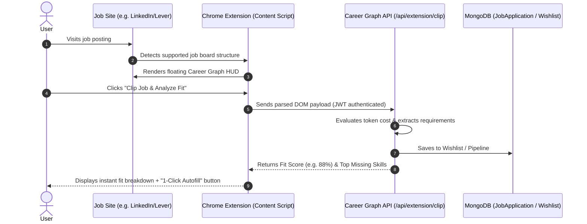

# feat-01: Chrome Extension & 1-Click Job Clipper & Application Autofill

## 1. Executive Summary

While Career Graph currently features an internal **Job Portal** and manual job tracking, job seekers spend over 85% of their search browsing external boards such as **LinkedIn, Indeed, Glassdoor, Greenhouse, Lever, Ashby, and Workday**. 

**feat-01** introduces the **Career Graph Browser Companion (Chrome / Edge / Brave Extension - Manifest V3)** that enables:
1. **1-Click Job Clipping**: Instant extraction of title, company, salary, location, and requirements from 50+ job portals directly into the user's Wishlist or Applied pipeline.
2. **Intelligent Application Autofill**: Automatically fills repetitive application fields (work history, education, skills, demographic questions, custom screening answers) across Greenhouse, Lever, Workday, and Taleo.
3. **On-Page ATS & Fit Overlay**: Displays the user's resume fit score and missing keywords as a floating HUD while browsing external jobs, without needing to switch tabs.

---

## 2. Competitive Advantage (Why This Outshines the Market)

- **TealHQ Comparison**: Teal offers clipping, but charges an expensive weekly subscription for deeper keyword insights and lacks deep Workday/Greenhouse automated field mapping.
- **Simplify.jobs Comparison**: Simplify excels at autofill, but lacks an integrated dynamic token economy, AI cover letter architect, and deep interview simulator.
- **The Career Graph Differentiator**:
  - The extension operates natively with Career Graph's **Token Economy**.
  - 1-click generation of tailored cover letters directly within the job posting page.
  - Automatic detection of duplicate applications across platforms.

---

## 3. Core Capabilities & User Flows



### 3.1 1-Click Job Extraction
- High-precision DOM selectors for:
  - **LinkedIn Jobs** (`.jobs-unified-top-card`, `.jobs-description-content`)
  - **Indeed** (`.jobsearch-JobInfoHeader`, `#jobDescriptionText`)
  - **Greenhouse** (`#header`, `#content`, `.application-form`)
  - **Lever.co** (`.posting-headline`, `.section.page-centered`)
  - **AshbyHQ** (`[data-test="job-title"]`, `[data-test="job-description"]`)
  - **Workday Career Sites**
- Fallback to an on-page **Heuristic AI Reader** using a micro Readability parser to clip from custom corporate career pages.

### 3.2 Automated Application Autofill
- Secure storage of candidate profile in Chrome storage (synchronized with Career Graph `/api/profile`).
- Automatic detection of standard inputs:
  - Contact details (First/Last name, Email, Phone, Country, Address)
  - Links (LinkedIn, GitHub, Portfolio, Twitter)
  - Work Experience & Education arrays
  - Work authorization / Sponsorship questions
  - Custom screening questions answered using user's bio and Gemini embeddings.

---

## 4. Technical Architecture

### 4.1 Extension Project Structure
```
extension/
├── manifest.json              # Chrome Manifest V3
├── src/
│   ├── background/
│   │   └── service-worker.ts   # Auth state, token sync, contextual menus
│   ├── content/
│   │   ├── parsers/           # Board-specific DOM parsers
│   │   │   ├── linkedin.ts
│   │   │   ├── indeed.ts
│   │   │   ├── greenhouse.ts
│   │   │   └── lever.ts
│   │   ├── autofill/          # Form filling logic & field mappers
│   │   └── ui/
│   │       ├── FloatingHud.tsx # React shadow-DOM injected floating pill
│   │       └── styles.css
│   ├── popup/
│   │   ├── PopupApp.tsx       # Extension popup menu & user token counter
│   │   └── index.html
│   └── shared/
│       └── types.ts
└── webpack.config.js / vite.config.ts
```

### 4.2 Backend API Additions
- **Endpoint**: `POST /api/extension/clip`
  - Auth: Extension Bearer API key or Better Auth session token.
  - Payload:
    ```typescript
    interface ClipJobPayload {
      title: string;
      company: string;
      companyLogo?: string;
      location: string;
      description: string;
      salary?: string;
      sourcePlatform: "linkedin" | "indeed" | "lever" | "greenhouse" | "ashby" | "workday" | "other";
      url: string;
      destination: "wishlist" | "applied";
      deductTokens?: boolean;
    }
    ```
  - Response: Saves entry, updates token balance, returns `jobId` and instant `fitScore`.

- **Endpoint**: `GET /api/extension/profile-data`
  - Fetches the user's master resume data, work history, and custom Q&A bank for autofill purposes.

---

## 5. Token Economy & Monetization Integration
- **Free Tier**: Unlimited clipping to Wishlist; 5 free autofills per month.
- **Token Tier**: 2 tokens per 1-Click Autofill on complex portals (e.g. Workday); 5 tokens for on-page instant AI Cover Letter draft.
- **Recruiter Link**: Clipped jobs are tagged with source attribution, expanding Career Graph's internal marketplace with fresh crowd-curated roles.

---

## 6. Phased Implementation Roadmap

1. **Sprint 1**: Set up Manifest V3 repo structure with Vite + CRXJS, Better Auth token handshake, and basic popup showing user token balance.
2. **Sprint 2**: Develop DOM parsers for LinkedIn and Indeed with floating HUD widget injected into shadow DOM.
3. **Sprint 3**: Add Greenhouse, Lever, and Ashby parsers; integrate `/api/extension/clip` endpoint with automated wishlist sync.
4. **Sprint 4**: Implement the 1-Click Autofill engine with profile mapping and screening question assistance.
5. **Sprint 5**: Submit to Chrome Web Store and Edge Add-ons marketplace.
