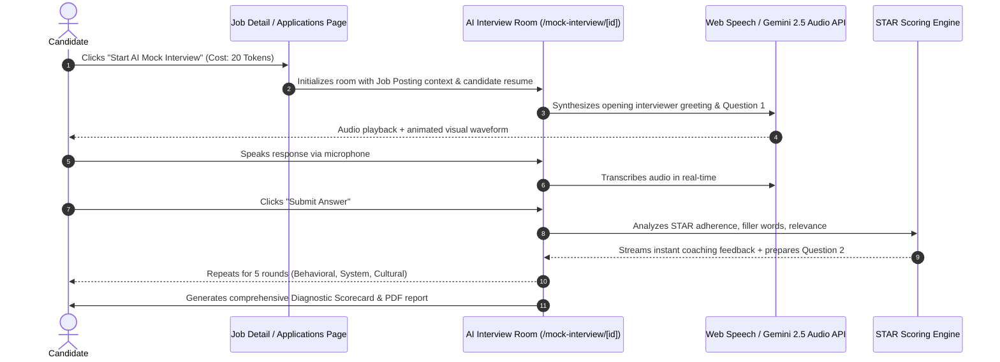

# feat-03: AI Voice & Audio Mock Interview Simulator (STAR Coach)

## 1. Executive Summary

Passing the ATS screening and submitting an application is only 20% of the battle; **over 80% of candidates are rejected in technical phone screens and behavioral rounds**. Currently, platforms either offer generic multiple-choice questions or charge exorbitant fees (e.g., Final Round AI charges upwards of $120/month).

**feat-03** introduces the **Career Graph AI Interview Simulator (STAR Coach)**:
1. **Targeted Company & Role Personas**: Generates an interviewer persona tailored to the specific role applied for (e.g., *"Sarah - Engineering Manager at Stripe"* or *"Marcus - Staff AI Lead at Anthropic"*).
2. **Interactive Audio / Voice Simulation**: Speaks questions aloud using natural neural TTS (Text-to-Speech) and records candidate audio using Web Speech API / MediaRecorder.
3. **Real-Time STAR Structure Evaluation**: Analyzes candidate responses on the **STAR framework** (Situation, Task, Action, Result), metrics quantification, technical accuracy, and conciseness.
4. **Instant Post-Interview Diagnostic Scorecard**: Comprehensive performance breakdown with filler word counters (`"um"`, `"like"`, `"you know"`), pacing/WPM analysis, missed job keywords, and an ideal reference response.

---

## 2. Competitive Advantage (Why This Outshines the Market)

- **Google Interview Warmup Comparison**: Warmup only offers a few generic job categories (e.g., "Data Analytics", "UX") with no company-specific context.
- **Final Round AI Comparison**: Highly expensive, aggressive lock-in subscriptions, and lacks integration with a personal job tracker.
- **The Career Graph Differentiator**:
  - **1-Click Launch from Job Detail Page**: Candidates can click `"Practice Interview for this Role"` directly from any job in the Job Portal or their Applications pipeline.
  - The AI interviewer leverages the exact **job requirements, tech stack, and company philosophy** stored in the database.
  - Fully integrated into Career Graph's **Token Economy**.

---

## 3. User Journey & Interview Flow



---

## 4. Technical Architecture

### 4.1 Frontend Component Stack
- **Audio Recording**: `MediaRecorder` API with 16kHz audio encoding (WAV/WebM).
- **Speech-to-Text**: Browser `webkitSpeechRecognition` with fallback to server-side Gemini audio transcription.
- **Text-to-Speech**: Web Speech `SpeechSynthesis` API with high-grade natural voices, with fallback to ElevenLabs or Google Cloud TTS audio streams.
- **Visualizer**: HTML5 Canvas audio spectrum analyzer reacting dynamically to candidate speech frequency.

### 4.2 Diagnostic Scoring Metrics
The evaluation engine returns a structured JSON payload:
```typescript
export interface MockInterviewEvaluation {
  overallScore: number; // 0 - 100
  dimensions: {
    starStructureScore: number; // Did they clearly articulate Situation, Task, Action, Result?
    technicalAccuracyScore: number;
    clarityAndPacingScore: number;
    culturalAlignmentScore: number;
  };
  fillerWordMetrics: {
    totalFillerWords: number;
    breakdown: Record<string, number>; // { "um": 4, "like": 7, "basically": 2 }
    wordsPerMinute: number;
  };
  keyConceptsHit: string[];
  missedOpportunities: string[];
  suggestedIdealResponse: string;
}
```

### 4.3 Database Model Addition (`src/lib/models.ts`)
```typescript
export interface IMockInterviewSession {
  _id?: string;
  userId: string;
  jobId?: string;
  applicationId?: string;
  roleTitle: string;
  companyName: string;
  interviewType: "behavioral" | "technical" | "system_design" | "executive";
  rounds: Array<{
    questionNumber: number;
    question: string;
    candidateAudioUrl?: string;
    candidateTranscript: string;
    evaluation: MockInterviewEvaluation;
    durationSeconds: number;
  }>;
  finalScore: number;
  summaryFeedback: string;
  completedAt: Date;
}
```

---

## 5. Token Economy & Monetization
- **Quick Practice (1 question drill)**: 5 tokens.
- **Full Mock Interview Session (5 comprehensive rounds + detailed scorecard)**: 20 tokens.
- **Pro Tier**: 2 full mock sessions per month included.

---

## 6. Phased Implementation Roadmap
1. **Sprint 1**: Design `/mock-interview` workspace layout with live audio visualizer and mic permissions.
2. **Sprint 2**: Build the interview prompt orchestrator connecting candidate resume + job posting requirements to generate progressive questions.
3. **Sprint 3**: Implement the speech-to-text listener and natural TTS audio playback.
4. **Sprint 4**: Develop the STAR evaluation engine and scorecard report component with download option.
5. **Sprint 5**: Add interview question banks tailored to FAANG/Tier-1 companies (Amazon Leadership Principles, Google GCA, Meta Core Values).
