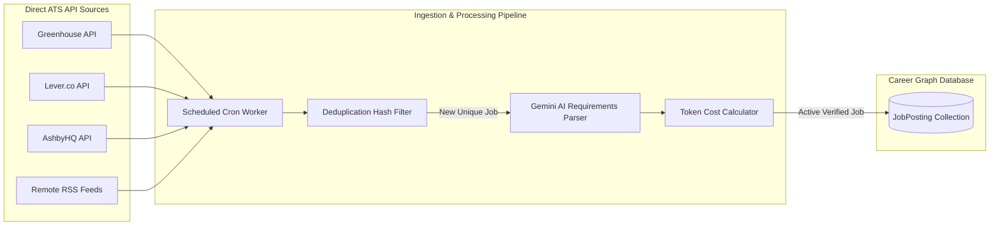

# feat-07: Automated Multi-Source Job Aggregator Engine (Greenhouse / Lever / Ashby APIs)

## 1. Executive Summary

A job portal's utility is directly proportional to the freshness, density, and quality of its job inventory. While Career Graph allows admins and recruiters to post jobs manually or from LinkedIn/Indeed, **manual entry cannot scale to hundreds of thousands of active postings**.

**feat-07** introduces the **Automated Multi-Source Job Aggregation & Ingestion Engine**:
1. **Direct ATS API Ingestion**: Integrates with public API boards from **Greenhouse, Lever.co, AshbyHQ, and BambooHR**, pulling real-time, verified engineering, product, design, and AI roles directly from top startups and enterprise companies.
2. **Automated AI Requirement & Metadata Extractor**: Automatically structures unformatted raw job descriptions into distinct requirements lists, perks, and salary bands using Gemini, dynamically computing the token cost.
3. **Dead-Link & Expired Job Sweeper**: Automated background worker that tests job links and marks expired listings as `"closed"` to eliminate ghost jobs.
4. **Instant Match Alerts**: Sends notification digests to users whose saved resume matches a newly scraped job with a Fit Score of 85%+.

---

## 2. Competitive Advantage (Why This Outshines the Market)

- **Standard Job Boards (Indeed/Monster)**: Littered with spam, duplicate staffing agency posts, and expired ghost jobs.
- **Career Graph Differentiator**:
  - We ingest **directly from company ATS endpoints** (Greenhouse, Lever, Ashby), guaranteeing 100% legitimate, direct-to-company postings with no middleman spam.
  - Automatically enriches each posting with **Token Cost calculation** based on requirements density.

---

## 3. Data Pipeline & Architecture



---

## 4. Technical Specifications

### 4.1 ATS Ingestion Connectors
1. **Greenhouse Connector**:
   - Endpoint: `https://boards-api.greenhouse.io/v1/boards/{company}/jobs?content=true`
   - Returns structured JSON with title, office location, department, and HTML content.
2. **Lever Connector**:
   - Endpoint: `https://api.lever.co/v0/postings/{company}?mode=json`
   - Returns structured JSON with salary ranges, workplace types, and requirement lists.
3. **AshbyHQ Connector**:
   - Endpoint: `https://api.ashbyhq.com/posting-api/job-board/{company}`
   - Clean, modern structured job descriptions with compensation bands.

### 4.2 Deduplication Engine
Jobs are hashed using a normalized signature:
```typescript
function generateJobHash(title: string, company: string, location: string): string {
  const normTitle = title.toLowerCase().replace(/[^a-z0-9]/g, "");
  const normCompany = company.toLowerCase().replace(/[^a-z0-9]/g, "");
  return `${normCompany}_${normTitle}`;
}
```

### 4.3 Scheduled Cron Job
Configured via Vercel Cron or Next.js scheduled route:
- **Route**: `GET /api/cron/sync-jobs`
- **Security**: Protected via `CRON_SECRET` bearer token.
- **Frequency**: Runs daily at 02:00 UTC, indexing 200+ curated tech companies (OpenAI, Stripe, Figma, Vercel, Supabase, Linear, etc.).

---

## 5. Token Economy & Monetization
- Candidates browse and filter aggregated jobs freely.
- Applying via Career Graph or generating tailored resumes and cover letters utilizes the standard token mechanism.

---

## 6. Implementation Roadmap
1. **Sprint 1**: Build the API adapters for Greenhouse and Lever.co in `src/lib/scrapers/`.
2. **Sprint 2**: Create the deduplication logic and Gemini parsing worker to extract requirements array and calculate token costs.
3. **Sprint 3**: Set up the automated cron schedule with error handling and rate-limiting.
4. **Sprint 4**: Add the Dead Link Checker worker to auto-close expired postings.
