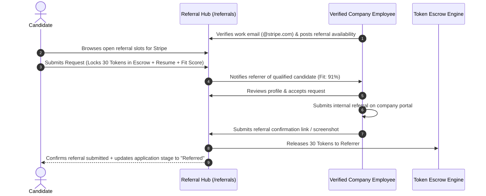

# feat-08: Community Employee Referral Marketplace & Peer Review Network

## 1. Executive Summary

Candidates referred by an existing company employee are **4 times more likely to get an interview and 15 times more likely to be hired** compared to cold applicants. Concurrently, employees at top tech companies receive **$2,000 to $10,000 referral bonuses** from their employers, giving them a strong incentive to refer top-tier candidates.

**feat-08** introduces the **Career Graph Community Referral Marketplace & Peer Review Network**:
1. **Verified Employee Referral Exchange**: Connects candidates with verified current employees at top tech firms (Google, Meta, Stripe, Amazon, Vercel) who can submit internal referrals.
2. **Anonymous Peer Resume Review**: Candidates submit their resumes to an anonymous community feed. Senior peers and hiring managers review them, providing actionable feedback.
3. **Circular Token Incentive Loop**:
   - Spend tokens to request an employee referral or senior peer review.
   - Earn tokens by providing constructive reviews or referring successful candidates.

---

## 2. Competitive Advantage (Why This Outshines the Market)

- **Blind / Fishbowl Comparison**: Blind is anonymous and chaotic, with no structured resume intake, no status tracking, and high spam.
- **Rooftop Community Comparison**: High upfront fees ($50 - $150 per referral request) with no verification of candidate qualifications.
- **The Career Graph Differentiator**:
  - Leverages Career Graph's **ATS Checker & Fit Score** to ensure candidates only request referrals when their profile meets the role's criteria (e.g. minimum 80% Fit Score required to request a referral).
  - Integrates seamlessly with our **Token Economy**, enabling users to *earn* their way to elite career tools without paying cash.

---

## 3. Marketplace Mechanics & Workflow



---

## 4. Technical Architecture

### 4.1 Database Models (`src/lib/models.ts`)
```typescript
export interface IEmployeeVerification {
  _id?: string;
  userId: string;
  companyName: string;
  corporateEmail: string;
  isVerified: boolean;
  verificationToken?: string;
  verifiedAt?: Date;
}

export interface IReferralRequest {
  _id?: string;
  candidateId: string;
  referrerId: string;
  jobId?: string;
  targetRole: string;
  targetCompany: string;
  resumeId: string;
  fitScoreAtRequest: number;
  tokenEscrowAmount: number;
  status: "pending" | "accepted" | "submitted" | "rejected" | "expired";
  submissionProofUrl?: string;
  createdAt: Date;
  updatedAt: Date;
}

export interface IPeerResumeReview {
  _id?: string;
  authorId: string; // Anonymous to viewers
  resumeSnapshotUrl: string;
  targetIndustry: string;
  targetLevel: string;
  reviews: Array<{
    reviewerId: string;
    score: number; // 1 - 5
    strengths: string;
    weaknesses: string;
    suggestions: string;
    createdAt: Date;
    tokensAwarded: number;
  }>;
  status: "open" | "completed";
  createdAt: Date;
}
```

---

## 5. Token Economy & Monetization
- **Requesting an Employee Referral**: 30 to 50 tokens (held in escrow until proof of internal submission is confirmed).
- **Submitting an Employee Referral**: Referrer earns 30 to 50 tokens (which can be cashed out or used across the platform).
- **Submitting Resume for Peer Review**: 15 tokens.
- **Reviewing a Peer's Resume**: Earn 10 tokens after the review is upvoted as constructive.

---

## 6. Implementation Roadmap
1. **Sprint 1**: Build corporate email verification engine using SendGrid / Postmark OTP tokens.
2. **Sprint 2**: Create the Referral Listing marketplace and Request modal with escrow handling.
3. **Sprint 3**: Implement the Anonymous Peer Resume Review feed with blur/redact tools for personal identifiable information (PII).
4. **Sprint 4**: Connect the referral status updates directly into the `/applications` Kanban pipeline.
