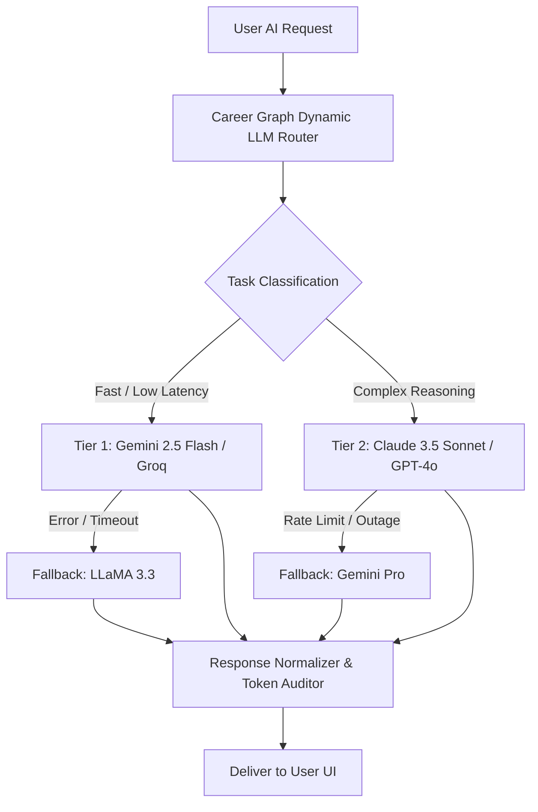

# feat-10: Multi-LLM Dynamic Routing, Progressive Web App (PWA) & Offline Privacy Architecture

## 1. Executive Summary

As AI-native platforms scale, relying on a single AI provider introduces severe risks: sudden rate limits, latency spikes, and vendor outages. Furthermore, candidates apply and interview on mobile devices on the go, requiring an app that works **offline, installs natively, and sends push notifications** without the overhead of maintaining separate Swift and Kotlin codebases.

**feat-10** introduces the **Career Graph Enterprise Infrastructure & Mobile PWA Layer**:
1. **Multi-LLM Dynamic Router & Fallback Mesh**: Intelligently routes tasks based on cost, speed, and reasoning depth:
   - *High-Speed Lightweight Tasks* (Keyword extraction, ATS scoring, email categorization): Routed to **Gemini 2.5 Flash** or **Groq / LLaMA 3.3 70B** (<350ms latency).
   - *Deep Creative Reasoning Tasks* (STAR resume tailoring, complex counter-offer negotiations, technical mock interviews): Routed to **Claude 3.5 Sonnet** or **OpenAI GPT-4o**.
   - *Automatic Failover*: Seamless, zero-downtime fallback if an API encounters rate limits or errors.
2. **Installable Progressive Web App (PWA)**: Offline-first architecture with `next-pwa` / Serwist, installable on iOS and Android home screens with native splash screens and smooth gestures.
3. **Web Push Notifications**: Real-time background push alerts for upcoming interviews, follow-up deadlines, and high-match job postings.
4. **Data Sovereignty & Privacy Guard**: End-to-end encryption for uploaded resume PDFs and 1-click GDPR/CCPA data export.

---

## 2. Competitive Advantage (Why This Outshines the Market)

- **Competitor Flaws**: Most career tech apps are desktop-only web apps or have clunky wrappers that crash when offline.
- **The Career Graph Differentiator**:
  - Candidates on the subway or travelling can review their saved jobs, resumes, and interview cheat-sheets completely offline.
  - Multi-LLM routing guarantees 99.99% AI uptime and the best possible output quality for every specific task.

---

## 3. Multi-LLM Routing Architecture



---

## 4. Technical Architecture

### 4.1 LLM Router Service (`src/lib/ai-router.ts`)
```typescript
export type AIModelTier = "fast" | "reasoning" | "vision";

export interface AIRouterOptions {
  task: "ats_check" | "bullet_enhance" | "cover_letter" | "mock_interview" | "negotiation";
  prompt: string;
  systemPrompt?: string;
  maxTokens?: number;
  temperature?: number;
}

export async function executeRoutedAI(options: AIRouterOptions): Promise<string> {
  // 1. Determine optimal model
  const tier: AIModelTier = 
    options.task === "ats_check" || options.task === "bullet_enhance" 
      ? "fast" 
      : "reasoning";

  const providers = tier === "fast" 
    ? ["gemini-flash", "groq-llama", "openai-mini"]
    : ["claude-sonnet", "openai-gpt4o", "gemini-pro"];

  // 2. Iterate providers with failover
  for (const provider of providers) {
    try {
      return await callProvider(provider, options);
    } catch (err) {
      console.warn(`Provider ${provider} failed, falling back to next...`, err);
    }
  }

  throw new Error("All AI providers failed. Please try again in a moment.");
}
```

### 4.2 PWA & Service Worker Config
- Configured using `@serwist/next` or `next-pwa` with `CacheFirst` strategies for UI assets and `NetworkFirst` with IndexedDB fallback for:
  - User's saved Resumes
  - Applications Kanban board
  - Saved Wishlist jobs
- Push notification service using Web Push standard (VAPID keys).

---

## 5. Token Economy & Monetization
- **High-speed Fast Tier executions**: Low token consumption (1 - 5 tokens).
- **Deep Reasoning Tier executions**: Premium token consumption (10 - 20 tokens).
- Transparent cost audit visible in user's Token History ledger.

---

## 6. Implementation Roadmap
1. **Sprint 1**: Abstract current Gemini calls into a unified provider adapter interface in `src/lib/ai/`.
2. **Sprint 2**: Add Claude 3.5 Sonnet and OpenAI fallback adapters with automated timeout retries.
3. **Sprint 3**: Configure PWA web app manifest, service worker caching, and app icons.
4. **Sprint 4**: Implement Web Push notifications for interview reminders and application updates.
5. **Sprint 5**: Add 1-click JSON/CSV data export and privacy controls in `/settings`.
