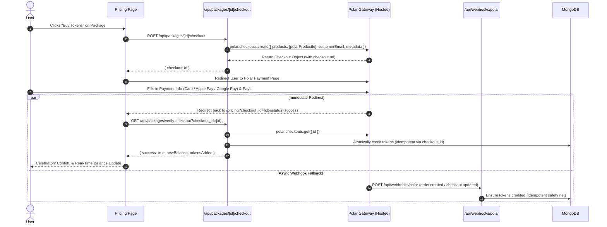

# Polar Payment Integration Implementation Plan

Replace the simulated token purchase modal with real **Polar** checkout pages, automatic token fulfillment, return verification, and webhook processing for the 3 specified one-time packages.

---

## 1. Context & Verified Information

- **Polar Access Token:** `POLAR_PAYMENT_TOKEN` in `.env.local`. Tested and confirmed active against Polar Sandbox (`https://sandbox-api.polar.sh`).
- **Product IDs mapped in Polar:**
  - **Starter Pack:** `8257b10e-414d-47b3-a1f6-b60928fbf606` (500 Tokens - $5.00 USD)
  - **Pro Pack:** `7956bd4f-a476-408a-a6ee-945a373539c0` (1,150 Tokens - $10.00 USD)
  - **Ultra Career Pack:** `0c29dce4-a185-49fb-9368-fa2c46dc32f8` (2,600 Tokens - $20.00 USD)
- **SDK:** `@polar-sh/sdk` is installed and verified.

---

## 2. Architecture & Payment Flow



---

## 3. Proposed Changes

### Backend & Database

#### [NEW] [polar.ts](file:///c:/Users/ismai/OneDrive/Desktop/Projects/Career-Graph-Project/src/lib/polar.ts)
- Initialize the Polar client instance using `POLAR_PAYMENT_TOKEN` and `POLAR_SERVER` (`sandbox` or `production`).
- Export canonical product ID mapping for fallback & sanity checks:
  ```ts
  export const POLAR_PRODUCT_MAP: Record<string, string> = {
    starter: "8257b10e-414d-47b3-a1f6-b60928fbf606",
    pro: "7956bd4f-a476-408a-a6ee-945a373539c0",
    ultra: "0c29dce4-a185-49fb-9368-fa2c46dc32f8",
  };
  ```

#### [MODIFY] [models.ts](file:///c:/Users/ismai/OneDrive/Desktop/Projects/Career-Graph-Project/src/lib/models.ts)
- Add `polarProductId?: string` to `ITokenPackage` and `tokenPackageSchema`.
- Ensure `TokenTransaction` supports metadata with `polarCheckoutId` and `polarOrderId` for idempotency tracking.

#### [MODIFY] [route.ts](file:///c:/Users/ismai/OneDrive/Desktop/Projects/Career-Graph-Project/src/app/api/packages/route.ts)
- Attach corresponding `polarProductId` values to default packages.
- Ensure package migration: if existing records in MongoDB lack `polarProductId`, map them automatically by name.

#### [NEW] [checkout/route.ts](file:///c:/Users/ismai/OneDrive/Desktop/Projects/Career-Graph-Project/src/app/api/packages/[id]/checkout/route.ts)
- Authenticates session user.
- Resolves the requested package from MongoDB.
- Creates Polar checkout session with:
  - `products: [pkg.polarProductId]`
  - `customerEmail: user.email`
  - `customerName: user.name`
  - `metadata: { userId: user.id, packageId: pkg._id.toString(), tokens: pkg.tokens }`
  - `successUrl: `${origin}/pricing?checkout_id={CHECKOUT_ID}&status=success``
- Returns `{ checkoutUrl: checkout.url }`.

#### [NEW] [verify-checkout/route.ts](file:///c:/Users/ismai/OneDrive/Desktop/Projects/Career-Graph-Project/src/app/api/packages/verify-checkout/route.ts)
- Verifies a completed checkout via Polar SDK (`polar.checkouts.get({ id: checkoutId })`).
- Checks if the session is `succeeded`.
- Idempotency check: verifies `TokenTransaction.findOne({ "metadata.polarCheckoutId": checkoutId })`.
- If not yet processed:
  - Calls `grantUserTokens` with user ID, token quantity, and checkout metadata.
  - Returns `{ success: true, newBalance, tokensAdded, packageName }`.

#### [NEW] [polar/route.ts](file:///c:/Users/ismai/OneDrive/Desktop/Projects/Career-Graph-Project/src/app/api/webhooks/polar/route.ts)
- Webhook endpoint for Polar.
- Verifies payload via `validateEvent` if `POLAR_WEBHOOK_SECRET` is configured.
- Processes `order.created`, `order.paid`, and `checkout.updated` events.
- Performs idempotent token crediting if the client-side redirect hasn't already fulfilled it.

---

### Frontend & UI

#### [MODIFY] [types.ts](file:///c:/Users/ismai/OneDrive/Desktop/Projects/Career-Graph-Project/src/components/dashboard/pricing/types.ts)
- Add optional `polarProductId?: string` to `TokenPackageData`.

#### [MODIFY] [PurchaseModal.tsx](file:///c:/Users/ismai/OneDrive/Desktop/Projects/Career-Graph-Project/src/components/dashboard/pricing/PurchaseModal.tsx)
- Transform from a "Simulated Instant Checkout" into a real "Checkout Order Summary" modal:
  - Highlights real payment security badges (Polar, Stripe, 256-bit SSL, Apple Pay, Google Pay).
  - Primary button: "Proceed to Polar Payment ($X.00)" with a loading spinner that redirects directly to `checkoutUrl`.
  - Replaces dummy instant credit message with real payment notice.

#### [MODIFY] [page.tsx](file:///c:/Users/ismai/OneDrive/Desktop/Projects/Career-Graph-Project/src/app/(dashboard)/pricing/page.tsx)
- Adds a checkout return detection hook using `useSearchParams`:
  - When returning with `checkout_id` & `status=success`:
    - Shows a verifying notification / banner.
    - Calls `/api/packages/verify-checkout?checkout_id=...`.
    - Triggers celebratory UI modal (confetti, tokens added celebration, new balance display).
    - Updates local token context and refreshes transaction ledger.
    - Cleans up query parameters with `window.history.replaceState` to prevent re-verification on page reload.

#### [MODIFY] [AdminPackageModal.tsx](file:///c:/Users/ismai/OneDrive/Desktop/Projects/Career-Graph-Project/src/components/dashboard/pricing/AdminPackageModal.tsx)
- Allows admins to optionally view or configure `polarProductId` when creating or editing packages.

---

## 4. Verification Plan

### Automated / End-to-End Tests
1. **API Test:** Invoke `POST /api/packages/[id]/checkout` with authenticated user session and verify response contains valid `https://sandbox.polar.sh/checkout/...` URL.
2. **Verification Test:** Test `GET /api/packages/verify-checkout` with checkout ID to verify double-credit prevention (idempotency).
3. **Typecheck & Lint:**
   - Run `npx tsc --noEmit` to ensure zero compilation or typing errors.
   - Run `pnpm run check` or `pnpm run lint` for code hygiene.

### Manual Verification
1. Navigate to `/pricing`.
2. Click "Buy Tokens" on "Starter Pack", "Pro Pack", or "Ultra Career Pack".
3. Click "Proceed to Polar Payment" in the order summary modal.
4. Verify browser navigates directly to Polar's official sandbox payment page showing the exact product, price, and branding.
5. Complete payment using Polar's test card details.
6. Verify redirect back to `/pricing` with celebration modal, tokens credited immediately to user balance, and entry in the Transactions Ledger.
